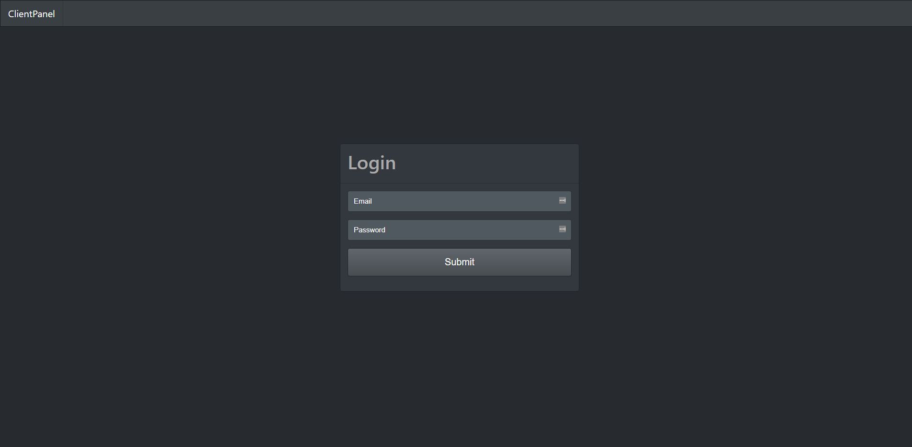
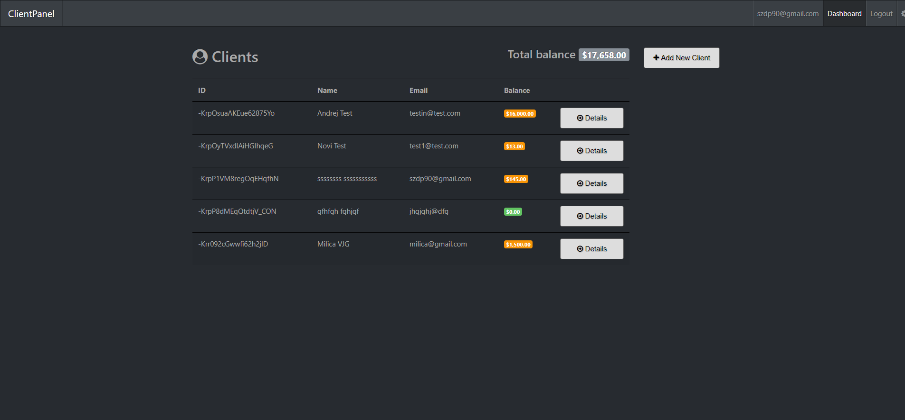
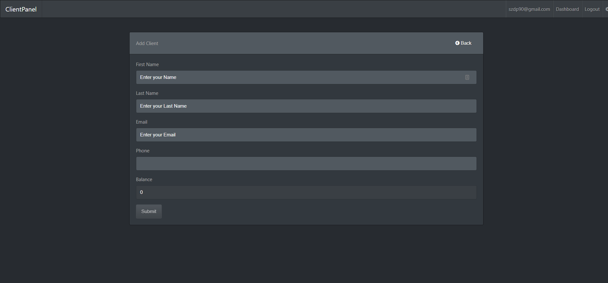

# ClientPanel

Client Panel Is Angular 4 App for tracking down a Client debt. Firebase is used as backend service. App cover all CRUD operations, User Authentification, route protection and custom app settings. You can disable registration, disable balance edit on multiple places, all in setting page. Bootstrap 4 is used for UI with custom theme from https://bootswatch.com.

##Instructions
This project was generated with [Angular CLI](https://github.com/angular/angular-cli) version 1.2.5 so make sure to have it globally installed.
Also you need to add your own Firebase Config in order to app work on your local setup.

Make sure you have these installed
1. [Node.js](www.nodejs.org).
2. [git](www.git-scm.com).
3. [Angular CLI](npm install -g @angular/cli).

Clone this repository into your local machine using the terminal (mac) or CMD (PC)
`git clone https://github.com/drejcreative/Gulp-Workflow.git`

Run `npm install` to install all dependencies.

Run `ng serve` for a dev server. Navigate to `http://localhost:4200/`. The app will automatically reload if you change any of the source files.
